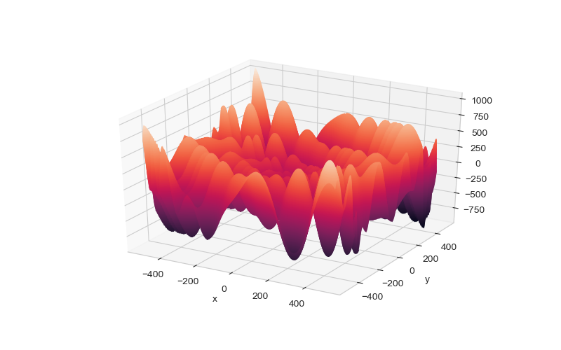
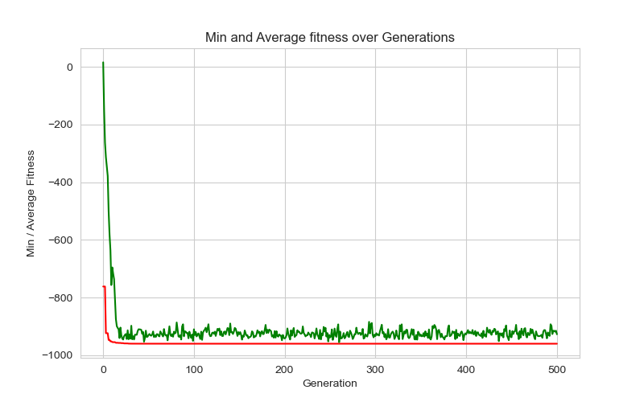

# Genetic Algorithm implementations in Python
Implementation of Genetic algorithms for applications:
- Optimizing continuous functions
- Feature selection for Machine learning algorithms
- Hypertuning Machine learning algorithms
## Optimizing the Eggholder function
The Eggholder function is given by:  
&emsp; &emsp; &emsp; &emsp; &emsp; &emsp;%3D-(y%2B47)%20%5Ccdot%20%5Csin%20%5Csqrt%7B%5Cleft%7C%5Cfrac%7Bx%7D%7B2%7D%2B(y%2B47)%5Cright%7C%7D-x%20%5Ccdot%20%5Csin%20%5Csqrt%7B%7Cx-(y%2B47)%7C%7D)

Optimization results:

